## mermaidでフローチャート
### 方向
- フローチャートを書く際は`graph`と書いて、後ろで方向をしてする

| 方向  | オプション |
|---|:-:|
|  上 → 下  |  TB, TD  |
|  下 → 上  |  BT  |
|  右 → 左 |  RL |
|  左 → 右  |  LR  |

#### 上から下
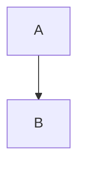
#### 下から上 
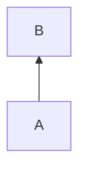
#### 右から左
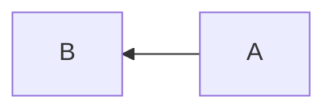
#### 左から右

--- 
## 書き方の基本
1.  Aという名前のノードを作成し、表示
```
graph RL
    A
```
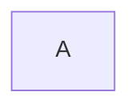
2. テキストを設定する場合は`[]`ないに書く

```
graph RL
    A["スタート"]
```


### ノードの繋ぎ方
#### 矢印で結ぶ
- AとBのノードを繋ぐには矢印で結ぶことができる


#### 矢印上にテキスト表示
- 矢印上のテキスト表示には矢印の間に記入

```
graph LR
    A -- "こんにちは" --> B
```

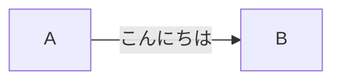
#### 線で結ぶ
- ノード間を線で結ぶ場合はハイフン3つ
```
graph LR
    A--B
```
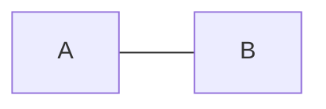
#### 点線矢印
- 間にドットを挟
```
graph LR
    A -.-> B
```
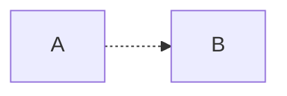
#### 太い矢印
- ハイフンでなく`=`で結ぶ
```
graph LR
    A ==> B
```
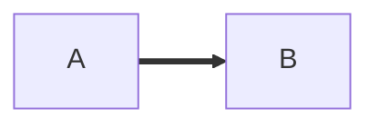
間にテキストも挟める
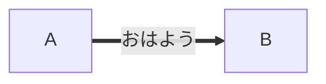
## ノードの形
#### ノードの角を丸める
- テキストを括弧で囲む
```
graph LR
    A("Start")
```
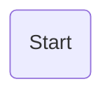

## 丸
- 二重括弧で円
```
graph LR
    A(("Start"))
```
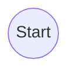
## 左右非対称

```
graph LR
    A>"おはよう"]
```

## 菱形
- 鉤括弧で菱形

```
graph LR
    A{"Text"}
```
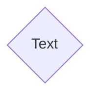

## 円柱
- `[()]`
```
graph LR
    A[("DataBase")]
```

---
### 例
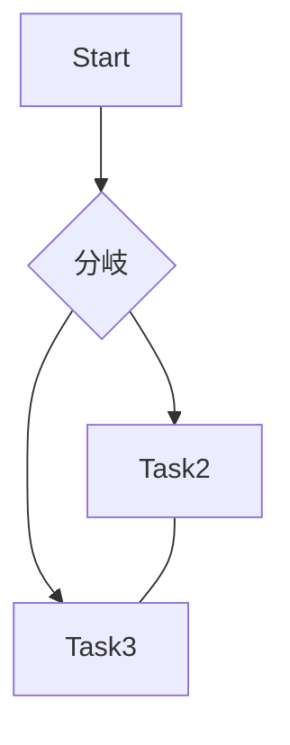

