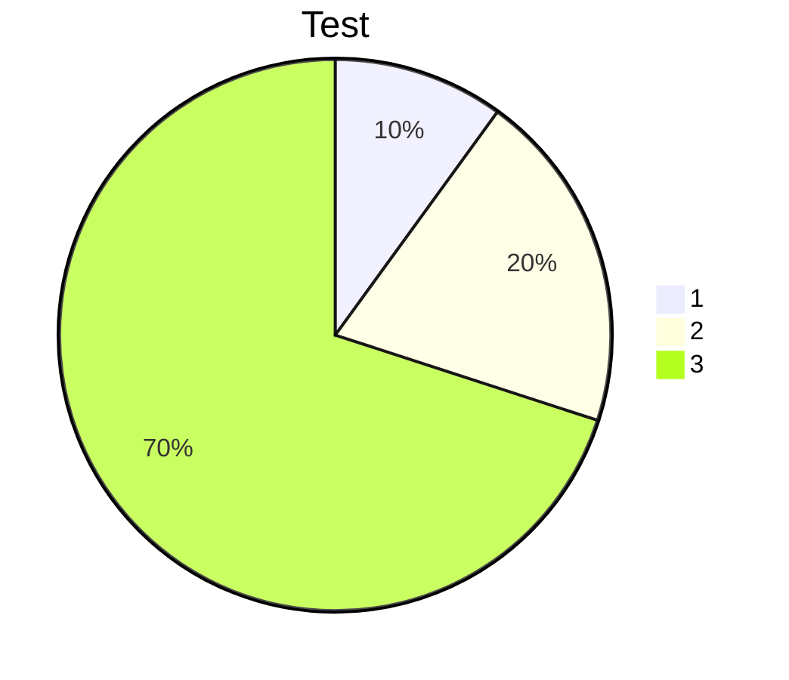
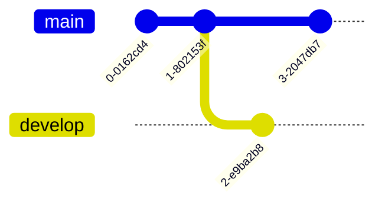
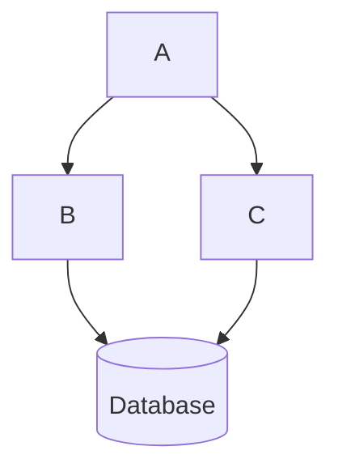

## 円グラフ

```mermaid
pie title Test
    "1" :  10
    "2" :  20
    "3" :  70
```

## gitグラフ

```mermaid
gitGraph
    commit
    commit
    branch develop
    commit
    checkout main
    commit
```

```mermaid
flowchart TB
    A --> B
    A --> C
    B & C --> DB[("Database")]
```